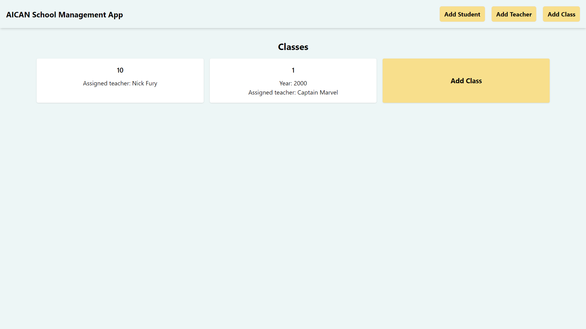
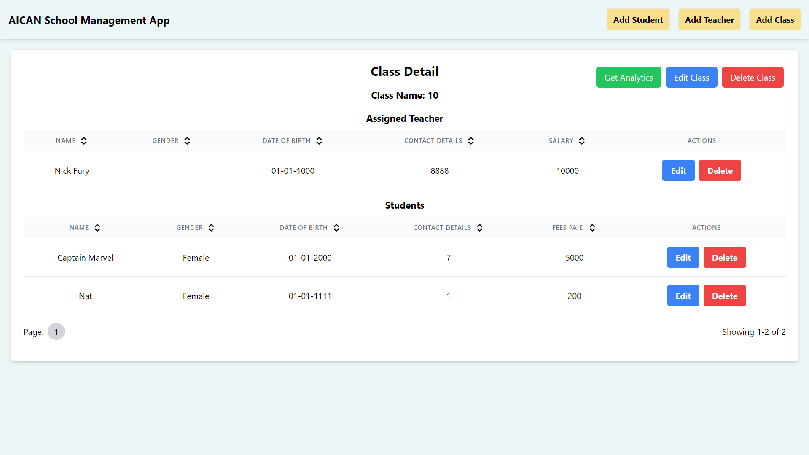
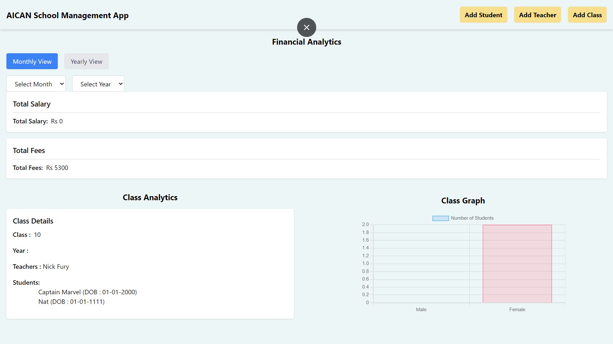
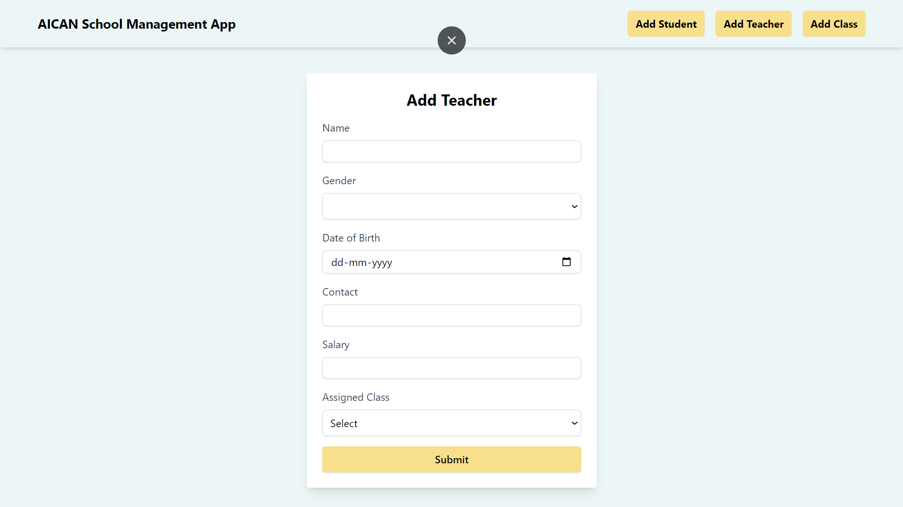
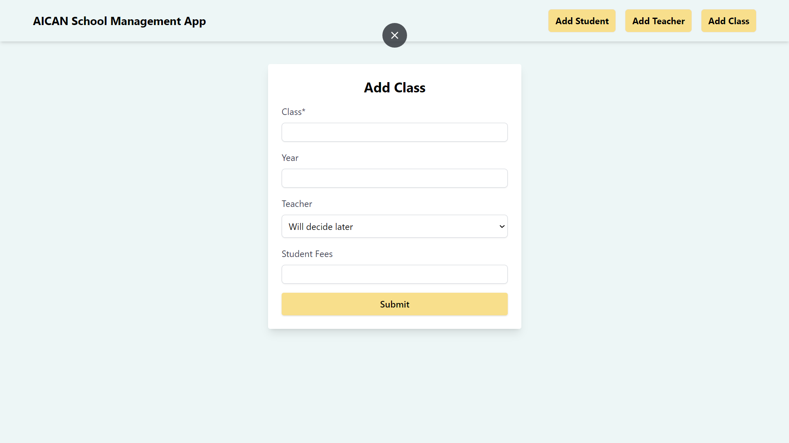

### Setting Up the Project

#### Client Folder (React)

To set up the client-side application, navigate to the `client` folder and run the following commands:

npm install
npm start


To build the client application for production, use the following command:

npm run build


#### Backend Folder (Server)

To set up the server-side application, navigate to the `server` folder and run the following commands:

npm install
npm run dev


### API Documentation

#### Class Endpoints

- **GET /api/analytics_class/:id**
  - Retrieves analytics data for a specific class.
  - Parameters:
    - `id`: Class ID.
  - Example: `/api/analytics_class/123`

- **GET /api/analytics_financial**
  - Retrieves financial analytics data.
  - Example: `/api/analytics_financial`

- **GET /api/get_all_classes**
  - Retrieves information for all classes.

- **POST /api/add_classes**
  - Creates a new class.
  - Request Body:
    ```json
    {
      "className": "Class Name",
      "year": 2024,
      "teacher": "Teacher ID",
      "studentFees": 500
    }
    ```
  - Example: `/api/add_classes`

- **GET /api/get_classes_by_id/:id**
  - Retrieves information for a specific class.
  - Parameters:
    - `id`: Class ID.
  - Example: `/api/get_classes_by_id/123`

- **PUT /api/update_classes_by_id/:id**
  - Updates information for a specific class.
  - Parameters:
    - `id`: Class ID.
  - Request Body:
    ```json
    {
      "className": "New Class Name",
      "year": 2025,
      "teacher": "New Teacher ID",
      "studentFees": 600
    }
    ```
  - Example: `/api/update_classes_by_id/123`

- **DELETE /api/delete_classes_by_id/:id**
  - Deletes a specific class.
  - Parameters:
    - `id`: Class ID.
  - Example: `/api/delete_classes_by_id/123`

#### Student Endpoints

- **GET /api/get_all_students**
  - Retrieves information for all students.

- **POST /api/add_students**
  - Creates a new student.
  - Request Body:
    ```json
    {
      "name": "Student Name",
      "gender": "Male",
      "dob": "2000-01-01",
      "contact": "1234567890",
      "feesPaid": 500,
      "className": "Class Name"
    }
    ```
  - Example: `/api/add_students`

- **GET /api/get_students_by_id/:id**
  - Retrieves information for a specific student.
  - Parameters:
    - `id`: Student ID.
  - Example: `/api/get_students_by_id/123`

- **PUT /api/update_students_by_id/:id**
  - Updates information for a specific student.
  - Parameters:
    - `id`: Student ID.
  - Request Body:
    ```json
    {
      "name": "New Student Name",
      "gender": "Female",
      "dob": "2000-01-01",
      "contact": "9876543210",
      "feesPaid": 600,
      "className": "New Class Name"
    }
    ```
  - Example: `/api/update_students_by_id/123`

- **DELETE /api/delete_students_by_id/:id**
  - Deletes a specific student.
  - Parameters:
    - `id`: Student ID.
  - Example: `/api/delete_students_by_id/123`

#### Teacher Endpoints

- **GET /api/get_all_teachers**
  - Retrieves information for all teachers.

- **POST /api/add_teachers**
  - Creates a new teacher.
  - Request Body:
    ```json
    {
      "name": "Teacher Name",
      "gender": "Male",
      "dob": "1980-01-01",
      "contact": "9876543210",
      "salary": 50000,
      "assignedClass": "Class Name"
    }
    ```
  - Example: `/api/add_teachers`

- **GET /api/get_teachers_by_id/:id**
  - Retrieves information for a specific teacher.
  - Parameters:
    - `id`: Teacher ID.
  - Example: `/api/get_teachers_by_id/123`

- **PUT /api/update_teachers_by_id/:id**
  - Updates information for a specific teacher.
  - Parameters:
    - `id`: Teacher ID.
  - Request Body:
    ```json
    {
      "name": "New Teacher Name",
      "gender": "Female",
      "dob": "1980-01-01",
      "contact": "1234567890",
      "salary": 60000,
      "assignedClass": "New Class Name"
    }
    ```
  - Example: `/api/update_teachers_by_id/123`

- **DELETE /api/delete_teachers_by_id/:id**
  - Deletes a specific teacher.
  - Parameters:
    - `id`: Teacher ID.
  - Example: `/api/delete_teachers_by_id/123`


  ### Screenshots of the Project

  

  

  

  

  
